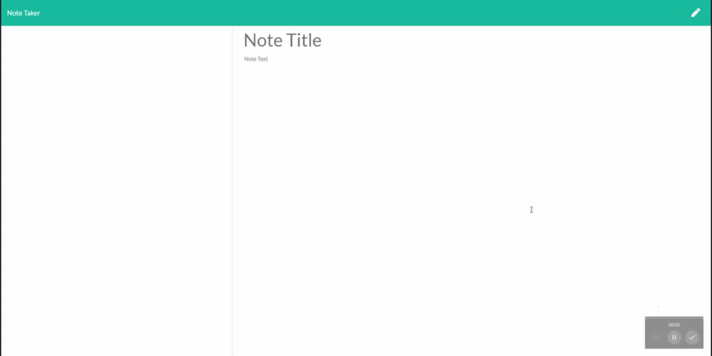
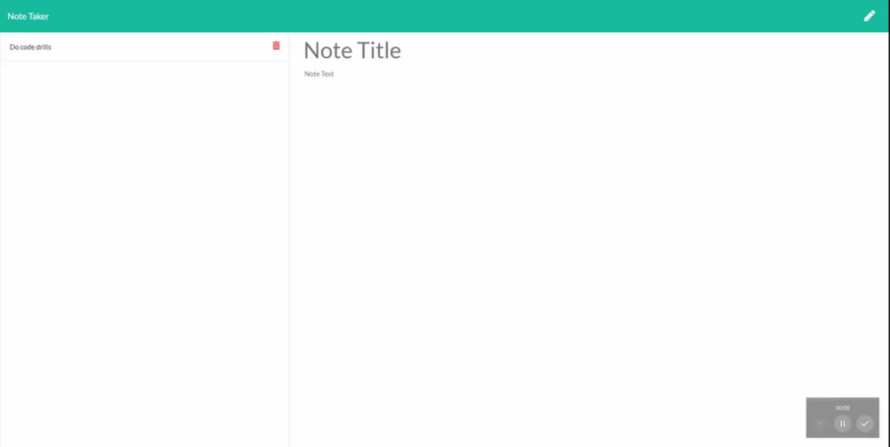

# Express Note Taker

## Deployed Link

To use the application, navigate to the deployed link on heroku [here](https://morning-fjord-88083.herokuapp.com)

## Description

Express based application that allows users to save and delete notes.

## Table of Contents

* [Installation](#Installation)
* [Usage](#Usage)
* [License](#License)
* [Dependencies](#Dependencies)
* [Questions](#Questions)

## Installation

To clone this project to your local machine, run the following command in your terminal

```
git clone https://github.com/sbarrow825/Unit-11-Express-Homework-Note-Taker.git
```

Make sure that you've downloaded [Node.js from the nodejs.org website](https://nodejs.org/en/download/), then run the following command in the working directory of this project to install the necessary node modules

```
npm install
```

## Usage

1) To add new notes, give the note a title and some text then hit the save button in the top, right-hand corner.



2) To delete a note, simply click the red icon next to the note you want to delete on the left.



## License


## Dependencies

List of dependency statuses for all packages used in this project

* npm express 


## Questions


For any questions concerning this project, please feel free to email me at sbarrow825@berkeley.edu

